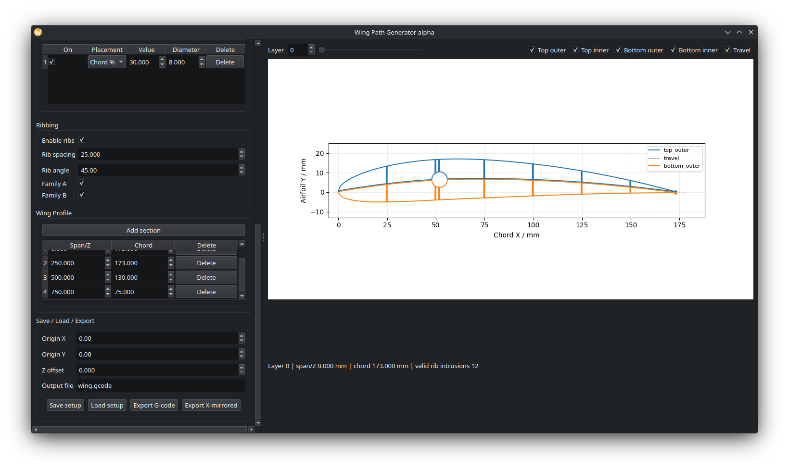

# RcWingGenerator
Automatically generate Gcode for the Tom Stanton Rc Wing 3D Printing Method

Firstly, This project takes it's inspiration from Tom Stanton's 3D printed wing method.
Tom Stanton's video showing his CAD based method:

https://www.youtube.com/watch?v=QJjhMan6T_E

I can't say for certain if he created it, or cited a source.

This project takes the CAD aspect out of the equasion and directly generates the same geometry and gcode from some basic design specifications and 3D printer settings.
Note: Most of the code was written by ChatGPT 5, and debugged in combination with CGPT and myself.

The UI consists of two panels, Left and Right. The left panel is the input panel, and the right is the matPlotLib display.

Input Panel
Broken into 
- Printer
- Airfoil Section
- Spars
- Ribbing
- Wing Profile
- Save/Load/Export

Printer
- Typical print settings similar to any slicer.

Airfoil Section
- Source Type: NACA 4-digit or local .dat
- Source: enter 4-digit NACA profile (defualt 4412) or select local .dat

Spars
- Confogurable table for spars
- Enter placement along Chord % if making a model to match the wing
- Enter LE distance if matching an existing model. Measure form leading edge to spar center (be sure to make a 1 layer test print to verify)
- Diameter: diameter in MM of the hole. This is the nozzle-center diameter, so be sure to add some buffer with a test print.

Ribbing
- This is where the real magic happens. The generator will create ribs at the given angle to the chord line (or 1/2 line width/layer, whichever is less)
- Rib Spacing: Distane between ribs in mm
- Rib Angle: Angle from the chord to the rib
- Family A: Ribs that run from leading edge to tail as layers increase (pointed rearward)
- Family B: Ribs that run from trailing edge to lead as layers increase (poiting forward)

Wing Profile
- A table of sections to print
- Span start of the section
- Chord: Chord length of the section (dimention critical chords will require a test print as they are nozzle-centered)
- Layers interpolate between chord lengths between two given spans, so two spans with the same chord will form a straight section, different chords will produce a tapered section

Save/Load/Export
- Origin X: X position of the leading edge centerpoint
- Origin Y: Y position of the leading edge centerpoint
- Z Offset: Offset from bed
- Output file: Default filename
- Save Setup: Saves a json file of the currently configured wing
- Load Setup: Loads a json file (currently partially implemented)
- Export G-code: Export a 3D printable G-code file
- Export X-mirrored: Exports a G-code file with X axis mirrored, for printing starboard wings.
